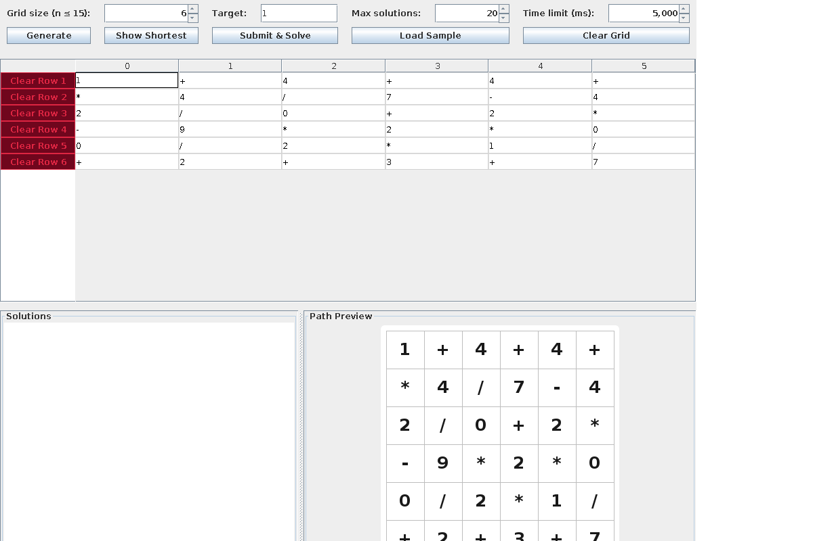

# 🧩 MazeSolver

> 🔢🎮 A cross-platform desktop app to solve **MathMaze puzzles** interactively.  
> Built with **Java 17 + Swing**, packaged into native installers using **Gradle + jpackage**.



---

## ✨ Features

- 🖥️ **Cross-platform**: macOS DMG, Windows MSI, Linux DEB/RPM installers
- 🎨 **Interactive Grid**: generate `n × n` puzzle grids (2 ≤ n ≤ 15)
- ➕➖✖️➗ **Operators + Numbers**: alternate correctly between numbers and operators
- 🐍 **Snake Traversal**: path search without revisiting cells
- 📊 **Exact Arithmetic**: rational math (fractions preserved, no rounding errors)
- 🎥 **Visualization**: animated path playback with Play / Pause / Reset
- 🗂️ **Multiple Solutions**: collect & view all valid paths, auto-select shortest
- 🧹 **UX Goodies**: clear row, clear grid, load sample puzzle, target value setting

---

## 🚀 Getting Started

### Prerequisites
- [Java 17+](https://adoptium.net)
- [Gradle 9+](https://gradle.org) (wrapper included)

### Build from Source

```bash
    git clone https://github.com/your-username/MazeSolver.git
    cd MazeSolver
    ./gradlew clean build shadowJar
```

### Run directly
```bash
    java -jar build/libs/MazeSolver-1.0.0.jar
```

## 📦 Native Installers

**Installers are built with jpackage. You can grab the latest .dmg, .msi, .deb, or .rpm from the Releases.**
- macOS → download MazeSolver.dmg and drag .app to Applications
- Windows → run the .msi installer (WiX based)
- Linux → install .deb or .rpm depending on your distro

## ⚙️ Development Workflow

```bash
    # Run on your OS:
    ./gradlew packageCurrentOS
    
    # Or build specific installers:
    ./gradlew jpackageMac   # macOS .dmg
    ./gradlew jpackageWin   # Windows .msi
    ./gradlew jpackageDeb   # Linux .deb
    ./gradlew jpackageRpm   # Linux .rpm
```

**Artifacts appear in: build/dist/\<os>/**

## 🤝 Contributing

Contributions, issues, and feature requests are welcome!
Feel free to open a PR or file an issue.

## 📜 License

This project is licensed under the MIT License.


